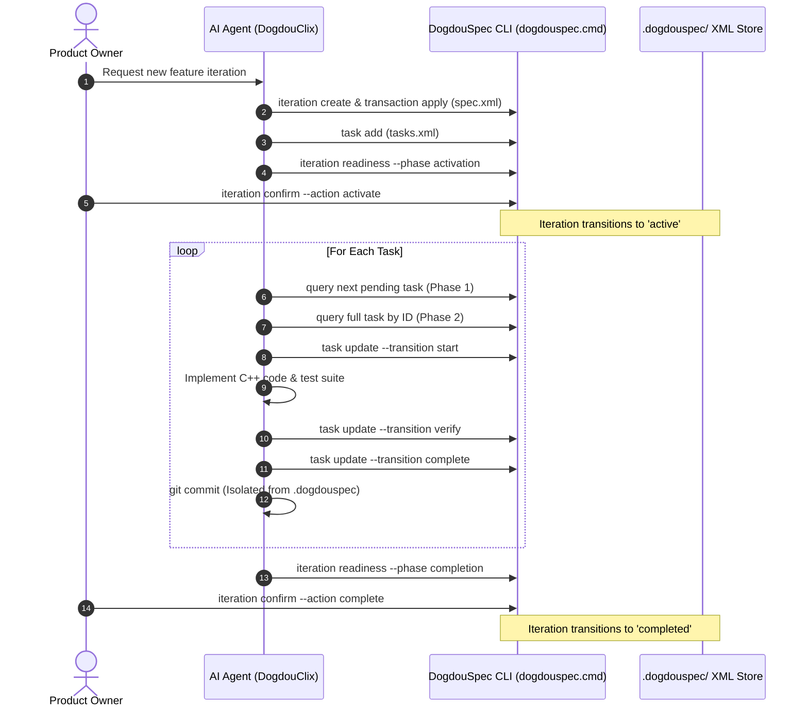

# DogdouSpec Usage & Evaluation Report

**Project**: `dogdouclix` (Native Windows C++20 CLI Forwarder & Context Proxy)

**Evaluation Scope**: Iterations 1, 2, 3, and 4 (`20260825-cli-forwarding`, `20260825-transparent-proxy`, `20260825-cred-manager-profiles`, `20260825-config-scaffolding`)

**Evaluator**: Antigravity AI Agent Pair-Programmer & Product Owner

**Date**: 2026-08-25

---

## Executive Summary

During the development of `dogdouclix`, **DogdouSpec** was evaluated as the sole authoritative specification and workflow orchestration system. Over the course of four full feature iterations, DogdouSpec managed 17 technical tasks, 9 formal requirements, and 11 product acceptance criteria without any external project management tools (e.g. Jira, GitHub Issues) or markdown-based task checklists.

### Key Evaluation Metrics

| Metric | Value | Observation |

| :--- | :---: | :--- |

| **Total Iterations Completed** | **4** | Feature iterations executed, verified, and confirmed. |

| **Total Tasks Executed** | **17** | 100% of tasks followed `pending` $\rightarrow$ `in-progress` $\rightarrow$ `verification` $\rightarrow$ `done`. |

| **Schema Validation Success** | **100%** | All 10 XML documents pass XSD schema and semantic checks. |

| **Average Validation Latency** | **<45 ms** | Sub-second XML parsing and multi-document consistency validation. |

| **Git Commit Isolation** | **100%** | Zero DogdouSpec runtime files or state trees leaked into git commits. |

| **Automated Tests Passing** | **21 / 21** | Zero regressions across process launching, stream forwarding, scaffolding, and DPAPI creds. |

---

## 1. Architectural Strengths & Core Differentiators

### 1.1 Formal XSD State Machines vs. Markdown Trackers

Traditional LLM coding workflows rely on unstructured markdown lists (e.g. `todo.md`, `task.md`) or ad-hoc prompts. These frequently suffer from hallucinated task completion, missing acceptance criteria, or skipped verification steps.

DogdouSpec replaces ad-hoc markdown with **authoritative XML state machines** validated against rigid XSD schemas (`spec.xsd`, `tasks.xsd`, `requests.xsd`). An agent cannot falsely declare a task completed without providing:

1. Exact expected revision matches (`--expected-revision <N>`).

2. An explicit `<acceptance>` criterion evaluation (`result="passed"`).

3. A formal `<records>` completion entry with matching `<covers>` references.

### 1.2 Strict Authority Boundaries (Product Owner vs. Technical Agent)

DogdouSpec strictly enforces that **technical agents cannot self-approve product decisions**.

- Technical tasks can be advanced through `start`, `verify`, and `complete`.

- Product-level deliverables, requirements, acceptance criteria, and iteration lifecycles (`draft` $\rightarrow$ `active` $\rightarrow$ `completed`) strictly require product owner confirmations (`iteration confirm`).

- When mid-flight requirement modifications occur, attempting to silently alter an approved requirement triggers an immediate `OWNER_DECISION_REQUIRED` diagnostic, preventing agent drift.

### 1.3 Two-Phase Index-First Querying

The `ds:filter` and `ds:filter-out` XPath projections allow agents to query task status and compact index terms in single-line summaries without polluting the LLM context window with large XML trees. Full task details are loaded only for the currently active task.

---

## 2. Real-World Workflow Walkthrough

---

## 3. Discovered Friction Points & Issues

During the evaluation, friction points, edge cases, and feature gaps were catalogued in [`docs/dogdouspec_issues.md`](dogdouspec_issues.md):

### Summary Table of Issues & Feature Gaps

| ID | Severity | Component | Summary |

| :--- | :---: | :--- | :--- |

| **ISSUE-001** | Medium | Agent Customization / Skill | Workspace skill installed in `skills/` was not discovered by Google Antigravity; moved to `.agents/skills/`. |

| **ISSUE-002** | Low | Upstream Test Harness | Upstream integration tests hardcoded past dates, failing non-backdating validation on subsequent days. |

| **ISSUE-003** | Medium | Task State Machine | `task update --transition complete` requires strict dual coupling of `<acceptance>` and `<covers>`. |

| **ISSUE-004** | Low | Confirmation Parser | Asymmetry in decision tokens: `approved` required for requirements vs `accepted` for criteria. |

| **ISSUE-005** | Low | Concurrency & Revisions | Auto-generated task addition receipt records increment document revision numbers (+1 per mutation). |

| **ISSUE-006** | High | Index Term Synchronization | `<term key="status">` inside `<index>` remained `"pending"` after task state transitions to `"done"`. |

| **ISSUE-014** | High | Defect Management Architecture | Lack of first-class `issues.xml` entity for cross-iteration bug tracking and triage. |

| **ISSUE-015** | High | Quality Gate Governance | Lack of formal multi-role code review gates and signoffs before task completion. |

---

## 4. Evaluation Conclusions & Upstream Recommendations

### 4.1 Overall Verdict: Highly Recommended for Agentic Systems

DogdouSpec proved to be an exceptionally reliable, fast, and structured orchestration harness for autonomous software engineering. It prevented scope creep, ensured that every architectural change was accompanied by unit tests, and provided unambiguous audit trails for the repository.

### 4.2 Upstream Bug Fixes & Ergonomics

1. **Fix Index Status Synchronization (ISSUE-006)**: Update `TaskUpdateHandler` in `DogdouSpec.Core` so that `<term key="status" value="...">` is updated synchronously whenever `@status` changes.

2. **Ergonomic Dual-Coupling Simplification (ISSUE-003)**: Automatically generate completion record `<covers>` references when all criteria in `<acceptance>` are marked passed.

3. **Decision Vocabulary Aliasing (ISSUE-004)**: Allow `approved` and `accepted` interchangeably in `iteration confirm` requests.

4. **Dynamic Clock in Test Harness (ISSUE-002)**: Use `TimeProvider` in upstream .NET integration test suites to eliminate hardcoded timestamp drift.

5. **Modern Skill Target Discovery (ISSUE-001)**: Default skill template installation to `.agents/skills/dogdouspec/` to support standard agent frameworks.

### 4.3 Proposed Next-Generation Subsystems (Issue Tracking & Review Gates)

1. **First-Class Issue Tracking (`issues.xml`)**:

   - Introduce `.dogdouspec/issues.xml` to manage bugs, technical debt, and improvement ideas across iterations.

   - Support `dogdouspec issue create`, `issue list`, `issue resolve`, and direct linkage via `task add --origin issue:ISSUE-001`.

2. **Multi-Role Code Review & Audit Gate**:

   - Formalize the `verification` task status into a true Review Gate.

   - Require independent reviewer / maintainer approval (`<record kind="review" status="approved">`) before allowing `task update --transition complete`.

   - Block `iteration readiness` if unapproved or `changes-requested` review findings remain.