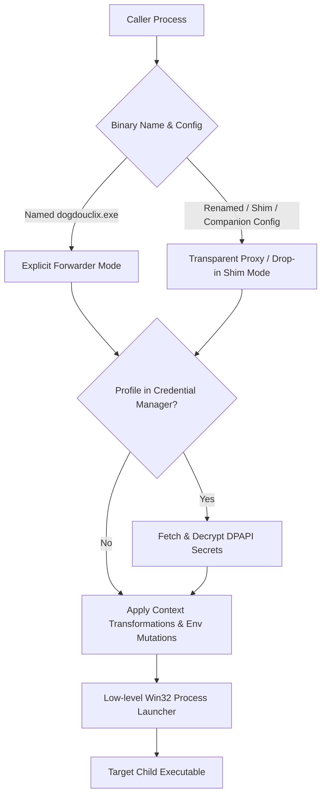

# DogdouClix User Guide & Architecture Reference

`dogdouclix` is a high-performance, lightweight (<150 KB) native Windows CLI interception, forwarding, and context-governance engine written in C++20.

It acts as an execution proxy between a caller and a target executable, ensuring verbatim command-line argument pass-through, real-time unbuffered I/O stream streaming, exit code fidelity, session/desktop inheritance, environment isolation/mutations, DPAPI-secured secret management, and cross-user context transitions.

---

## 1. Operating Modes

DogdouClix operates in two primary modes:



### 1.1 Explicit Forwarder Mode
Used when explicitly calling `dogdouclix.exe` with control flags and the target executable name:
```powershell
dogdouclix.exe [options] [--] <target.exe> [target_arguments...]
```

### 1.2 Transparent Proxy / Drop-in Shim Mode
Used when DogdouClix is deployed as a drop-in replacement for a target executable (via binary rename, hardlink, symlink, or a higher-priority `PATH` entry).
- **Zero Caller Awareness**: The caller invokes the shim directly (e.g. `git.exe commit -m "feat: hello"`).
- **Automatic Slicing**: DogdouClix removes `argv[0]` and forwards all following raw command-line tokens directly to the target executable.
- **Context Loading**: Context rules are automatically loaded from companion configuration files (`.clix.json` or `.clix.ini`), `DOGDOUCLIX_TARGET`, or resolved via `PATH` penetration.

---

## 2. CLI Command Reference (Explicit Mode)

### Execution Options
| Flag | Parameter | Description |
| :--- | :--- | :--- |
| `--clix-profile` | `<NAME>` | Loads execution context from a secure Windows Credential Manager profile. |
| `--clix-config` | `<FILE>` | Loads an external companion configuration (`.json` or `.ini`). |
| `--clix-env-set` | `KEY=VALUE` | Inserts or overwrites an environment variable in the child process. |
| `--clix-env-remove` | `KEY` | Unsets/redacts an environment variable in the child process. |
| `--clix-cwd` | `<DIR>` | Sets the working directory for the target child process. |
| `--clix-desktop` | `<DESKTOP>` | Specifies the desktop station (e.g. `winsta0\default`). |
| `--clix-user` | `<USERNAME>` | Executes the target under the specified username. |
| `--clix-domain` | `<DOMAIN>` | Windows domain for user credentials. |
| `--clix-password` | `<PASSWORD>` | Password for user authentication. |
| `--clix-load-profile` | _(None)_ | Loads the target user's profile hive into the registry. |
| `--` | _(None)_ | Explicit delimiter. All subsequent tokens are treated as the target and its arguments. |
| `--clix-version`, `-V` | _(None)_ | Displays version information. |
| `--clix-help`, `-h` | _(None)_ | Displays help and usage message. |

### Profile Management Commands
| Command | Parameters | Description |
| :--- | :--- | :--- |
| `--clix-profile-set` | `<NAME> [options...]` | Creates or updates a profile stored securely in Windows Credential Manager. |
| `--clix-profile-get` | `<NAME>` | Displays metadata and configuration for a registered profile (password masked). |
| `--clix-profile-delete` | `<NAME>` | Deletes a profile from Windows Credential Manager. |
| `--clix-profile-list` | _(None)_ | Lists all registered DogdouClix profiles. |

### CLI Usage Examples
```powershell
# 1. Register a secure profile in Windows Credential Manager
dogdouclix.exe --clix-profile-set ProductionVault `
  --clix-user DeployBot `
  --clix-domain CORP `
  --clix-password "SecretPass123!" `
  --clix-env-set "API_SECRET=LiveVaultToken999" `
  --clix-env-remove "STALE_LOCAL_TOKEN"

# 2. View registered profiles
dogdouclix.exe --clix-profile-list
dogdouclix.exe --clix-profile-get ProductionVault

# 3. Execute target using secure profile (no secrets exposed on command line)
dogdouclix.exe --clix-profile ProductionVault python.exe deploy.py

# 4. Inject a secret environment variable ad-hoc without altering parent shell
dogdouclix.exe --clix-env-set API_KEY=secret_token_123 python.exe fetch_data.py

# 5. Redact a sensitive token from child environment
dogdouclix.exe --clix-env-remove AWS_SECRET_ACCESS_KEY node.exe deploy.js

# 6. Switch working directory and pass flags containing dashes
dogdouclix.exe --clix-cwd "D:\Project" -- git.exe log -n 5
```

---

## 3. Windows Credential Manager Profile Infrastructure

DogdouClix provides a built-in infrastructure for protecting credentials and API secrets using the native **Windows Credential Manager** (`wincred.h`):

- **DPAPI Encryption**: All stored passwords and environment secrets are encrypted by Windows Data Protection API (DPAPI) and tied to the user session.
- **Zero Plaintext in Version Control**: Configuration files committed to git only contain the profile name (e.g. `"profile": "ProductionVault"`), completely eliminating hardcoded plaintext secrets.
- **Auto-Injection**: At process launch, DogdouClix retrieves the profile directly from Windows Credential Manager, decrypts the environment variables in memory, and passes them into the child process.

---

## 4. Companion Configuration Reference (Transparent Shim Mode)

When acting as a transparent shim, DogdouClix automatically searches for companion configuration files in the executable directory in the following order:
1. `<exename>.clix.json` (e.g., `git.exe.clix.json`)
2. `<exebasename>.clix.json` (e.g., `git.clix.json`)
3. `<exename>.clix.ini`
4. `<exebasename>.clix.ini`
5. `clix.json` / `clix.ini`

### 4.1 JSON Configuration Schema (`.clix.json`)
```json
{
  "target": "C:\\Program Files\\Git\\cmd\\git.exe",
  "profile": "ProductionVault",
  "cwd": "D:\\workspace",
  "desktop": "winsta0\\default",
  "env_set": {
    "SSH_AUTH_SOCK": "C:\\Secrets\\ssh-agent.sock",
    "MY_INJECTED_VAR": "NonSecretConfig"
  },
  "env_remove": [
    "CALLER_PRIVATE_TOKEN",
    "AWS_SECRET_ACCESS_KEY"
  ]
}
```

### 4.2 INI Configuration Format (`.clix.ini`)
```ini
[target]
executable = C:\Program Files\Git\cmd\git.exe
profile = ProductionVault
cwd = D:\workspace
desktop = winsta0\default

[env.set]
SSH_AUTH_SOCK = C:\Secrets\ssh-agent.sock
MY_INJECTED_VAR = NonSecretConfig

[env.remove]
CALLER_PRIVATE_TOKEN = 1
AWS_SECRET_ACCESS_KEY = 1
```

---

## 5. Target Resolution & PATH Penetration

When DogdouClix is renamed to a target binary (e.g., `kubectl.exe`) without an explicit `target` path in config:
1. **Self-Inspection**: DogdouClix detects that its executable base name is not `dogdouclix`.
2. **PATH Search**: It iterates over each directory listed in the system `PATH` environment variable.
3. **Anti-Recursion Filtering**: It normalizes and compares each `PATH` entry against its own directory. If an entry points to its own directory, it is **strictly skipped**.
4. **Target Discovery**: The first downstream executable matching the name is selected as the authentic target.

---

## 6. Important Precautions & Architectural Guarantees

> [!IMPORTANT]
> **Environment Isolation Guarantee**
> All environment mutations (`--clix-env-set`, `--clix-env-remove`, and configuration/profile rules) are applied exclusively to the newly spawned child process via an isolated double-null-terminated Unicode environment block. **The caller's parent environment is never polluted or modified.**

> [!IMPORTANT]
> **Handle Inheritance & Stream Transparency**
> DogdouClix uses Win32 `STARTUPINFOEXW` with `PROC_THREAD_ATTRIBUTE_HANDLE_LIST`. Only valid standard I/O handles (`stdin`, `stdout`, `stderr`) are marked inheritable and passed to the child. Unrelated parent handles are blocked, preventing handle leakage and deadlocks in redirected pipelines.

> [!NOTE]
> **Console Signal Delegation**
> When a user presses `Ctrl+C` or `Ctrl+Break`, DogdouClix's internal console handler delegates termination control to the child process, allowing graceful shutdowns and preventing premature forwarder termination.

---

## 7. Build and Test

DogdouClix is built using MSVC C++20 and CMake. A root automated build script is provided:

```cmd
.\build.cmd
```

The script automatically:
1. Detects Visual Studio 2022 / Visual Studio 18 installation.
2. Initializes the `x64` toolchain via `vcvars64.bat`.
3. Configures and compiles the CMake `Release` targets (`dogdouclix_core.lib`, `dogdouclix.exe`, and `dogdouclix_tests.exe`).
4. Executes the complete CTest automated test suite with 100% pass verification.